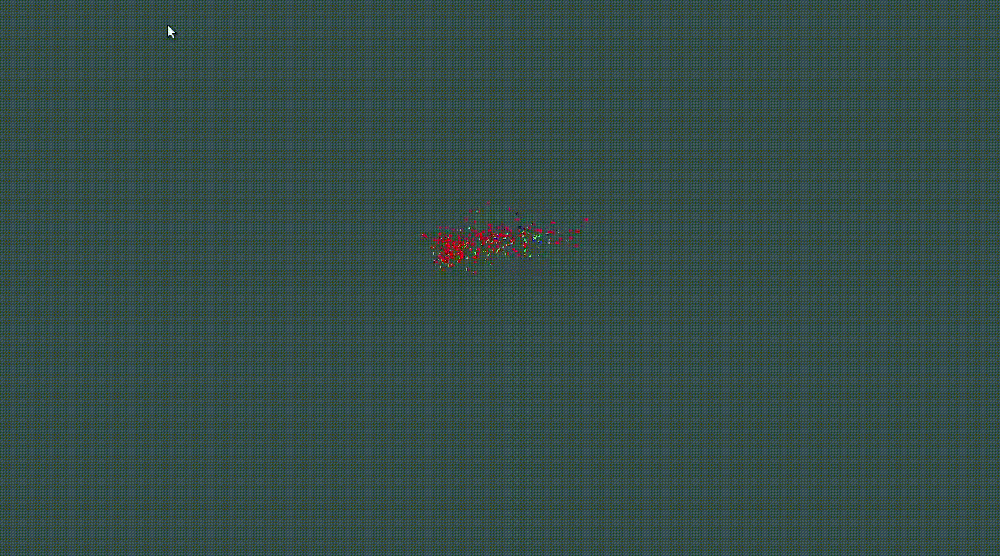

# Flocking algorithm in OpenGL 

Small OpenGL example using the [Flocking algorithm](http://www.red3d.com/cwr/boids/) in 3D.
A central force proportional to the distance from the coordinate origin is applied to keep the boids in frame.
This also creates a fun chaotic behaviour. 

One could also move the visible frame according to the center of mass, but that is a project for another day ;)

The frame can be controlled with the cursor (see `callback.cpp`).

## Example



## Dependencies:

- [GLFW 3](https://www.glfw.org/)  
- [GLAD](https://github.com/Dav1dde/glad)  
> glad could work without installing since I've added my own glad files in the src folder  
- [GLM](https://glm.g-truc.net/0.9.9/index.html)  

## How to run:

1. compile  
```bash
make all
```
2. run
```bash
./main.exec
```

Only tested on linux, if one wants to run it on windows, it is probably necessary to link against
```
-lopengl32 -ldl -lglfw3 -lstdc++
```
and include the `glfw3.dll` in the source folder.
